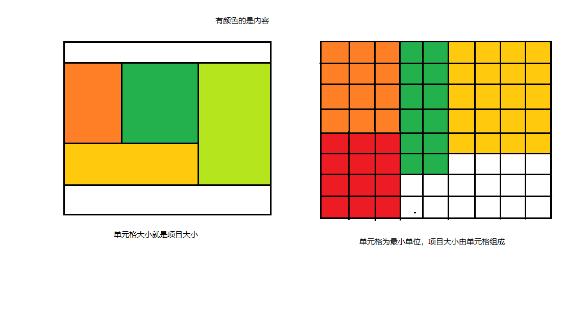

## grid学习

###### 本文是基于阮一峰老师的CSS Grid 网格布局教程做的总结，若有相关问题，前往[阮一峰老师教程](https://www.ruanyifeng.com/blog/2019/03/grid-layout-tutorial.html) 学习。

### 总结：

- **grid的使用方式：单元格大小就是项目大小（推荐）或单元格以较小单位组成项目大小**

  

- gird兼容性：支持chrome、Firefox、Safari、Edge、IE10及以上浏览器，IE浏览器要加上前缀**-ms-**

- 使用grid后要尽量避免再使用**浮动**、**定位**、**display设置**等样式

- grid属于二维布局，能够在X轴和Y轴随意调整内容位置

- html基础结构,parent为容器，son就是项目，而grandson则不受grid的影响

  ```html
  <div class="parent">
      <div class="son">
          <div class="grandson"></div>
      </div>
      <div class="son"></div>
  </div>	
  ```


### grid属性

##### 容器属性

1. display属性  声明容器   

   ```css
   .parent{
       display:grid; /*整个容器为块级元素*/
   }
   .parent{
       display:inline-grid; /*整个容器为行内元素*/
   }
   ```

2. grid-template-columns/grid-template-rows 单元格大小

   ```css
   /*基础用法  单位可以为绝对值150px,可以为百分比33.3%,可以为最小相对单位fr*/
   .parent{
       display:grid;
       grid-template-columns:150px 20% 1fr 3fr;
   }
   /*repeat(次数，值)*/
   .parent{
       display:grid;
       grid-template-columns:repeat(3,150px);
       /*grid-template-columns:repeat(3,150px 200px 300px);*/
   }
   /*auto-fill 单元格大小固定，容器大小不固定，类似浮动*/
   .parent{
       display:grid;
       grid-template-columns:repeat(auto-fill,100px);/*列宽100px*/
   
   ```

3. grid-gap可缩写为gap  行列间距

   ```css
   /*gap:列间距 行间距;*/
   .parent{
       display:grid;
       gap:20px 20px;
   }
   ```

4. grid-auto-flow  排序默认先行后列

   ```css
   .parent{
       display:grid;
       grid-auto-flow:column;/*先列后行*/
       grid-auto-flow:row;/*先行后列（默认）*/
       grid-auto-flow:column dense;/*先列后行，自动填满空格*/
       grid-auto-flow:row dense;/*先列后行，自动填满空格*/
   }
   ```

5. place-items  单元格中内容的对齐方式

   ```css
   /*place-items:垂直方向 水平方向;  start/end/center*/
   .parent{
       display:grid;
       place-items:start end;
   }
   ```

   

##### 项目属性

1. 