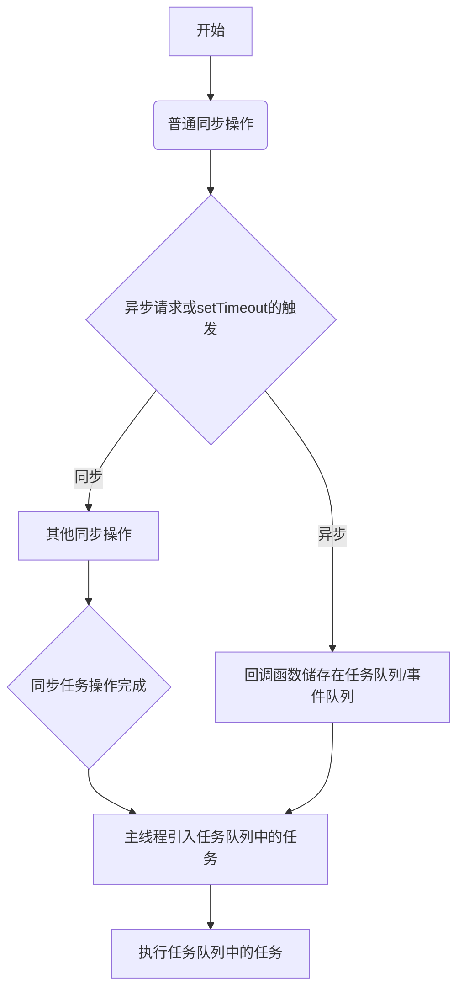

### 验证

邮箱验证

```javascript
function isEmail (s) {
  return 
    /^([a-zA-Z0-9_-])+@([a-zA-Z0-9_-])+((.[a-zA-Z0-9_-]{2,3}){1,2})$/.test(s)
}
```

手机号验证

```javascript
function isMobile (s) {
  return /^1[0-9]{10}$/.test(s)
}
```

电话号码验证

```javascript
function isPhone (s) {
  return /^([0-9]{3,4}-)?[0-9]{7,8}$/.test(s)
}
```

URL地址验证

```javascript
function isURL (s) {
  return /^http[s]?:\/\/.*/.test(s)
}
```


### 节流与防抖

**相同点：在不影响用户体验的前提下，将频繁的函数触发进行次数缩减，以避免性能消耗和页面卡顿,都可适用于 mousemove、scroll、resize、input 等事件**

**不同点：防抖是将多次的触发变成只执行最后一次事件的触发，节流是在一定时间内只触发一次函数**

**适用：*防抖*  就像法师放技能前的吟唱，需要一段时间才能释放，若是途中打断则需要在此吟唱(等待一段时间)，最后只触发一次；search搜索联想/input输入发出请求时，window触发resize的时候，不断调整浏览器最后只触发一次。  *节流*  鼠标不断拖动触发，mousedown(每几秒内触发一次)，监听滚动事件scroll，加载更多**

​		

```javascript
//防抖
debounce(fn,wait){
    //fn->要执行的函数   wait->规定时间
    let timer = null
    return ()=>{
        if(timer!==null) clearTimeout(timer)
        timer = setTimeout(fn,wait)
    }
}
yourfn(){
    console.log(Math.random())
}
//滚动触发
window.addEventListener('scroll',debounce(yourfn,1000))  
//视窗大小改变触发
window.addEventListener('resize',debounce(yourfn,1000))  
```


```javascript
//节流
throttle(fn,delay){
    let prev = Date.now()
    return ()=>{
        let now = Date.now()
        if(now-prev>delay){
            fn()
            prev = Date.now()
        }
    }
}

yourfn(){
    console.log(Math.random())
}
//滚动触发
window.addEventListener('scroll',throttle(yourfn,1000))  
//视窗大小改变触发
window.addEventListener('resize',throttle(yourfn,1000)) 
```


### Date自定义格式化日期

```javascript
Date.prototype.toLocaleString = function(str, sec){
    // 补0   例如 2018/7/10 14:7:2  补完后为 2018/07/10 14:07:02
    function addZero(num) {
        if (num < 10)
            return "0" + num;
        return num;
    }
    // 按自定义拼接格式返回
    if (sec === "year") {
        return this.getFullYear()
    } else if (sec === "month") {
        return this.getFullYear() + str + addZero(this.getMonth() + 1)
    } else if (sec === "date") {
        return this.getFullYear() + str + addZero(this.getMonth() + 1) + str + addZero(this.getDate())
    } else if (sec === "sec") {
        return this.getFullYear() + str + addZero(this.getMonth() + 1) + str + addZero(this.getDate()) + " " +
            addZero(this.getHours()) + ":" + addZero(this.getMinutes()) + ":" + addZero(this.getSeconds());
    }
}
let time = new Date(Date.now()).toLocaleString('-','year')
console.log(`现在时间时${time}`)
```


### 对象键为特殊符号时的取值方法

```javascript
let obj = {%:1,小黄:2}
console.log(obj['%'],obj['小黄'])
```


### 上传方式

```javascript
//使用input[type="file"]方式
//html
<input type="file" @change="upload">
//js
upload(e){
    let param = new FormData()
    //也可以使用append添加其他参数
    param.append('file',e.target.files[0])
    this.$api.update.upload(param).then(res=>{
        //something
    })
}
//接口设置
upload(params) {
    return axios.post(`${base.baseurl}/markdown/fdsFile`, (params), {
      headers: {
        'Content-Type': 'multipart/form-data'
      }
    })
  },
```


### 下载Excel方式

```javascript
 //1.后端完全处理  直接下载  使用创建表单方式 input相当于参数
 	  let formElement = document.createElement("form");  //创建表单
      formElement.style.display = "display:none;";  //隐藏表单
      formElement.method = "get";   //请求方式
      formElement.action = "http://localhost:8081/bsa-admin/hgas/exportExcel";  //请求地址
      formElement.target = "callBackTarget";  //页面打开方式
      let inputElement = document.createElement("input");  //创建input
      inputElement.type = "hidden"; 
      inputElement.name = "engineId";  //相当于参数名
      inputElement.value = this.hostDatax.engine_id;  //参数的具体值
      formElement.appendChild(inputElement);  //将input放入form中
      if (this.starTime) {
        let inputElement3 = document.createElement("input");
        inputElement3.type = "hidden";
        inputElement3.name = "starttime";
        inputElement3.value = this.starTime;
        let inputElement4 = document.createElement("input");
        inputElement4.type = "hidden";
        inputElement4.name = "endtime";
        inputElement4.value = this.endTime;
        formElement.appendChild(inputElement3);
        formElement.appendChild(inputElement4);
      }
      document.body.appendChild(formElement);  //将form放到body中
      formElement.submit();  //提交表单
      document.body.removeChild(formElement);  //移除表单元素


//2.前端处理返回的文件流 常用get请求 
axios.get(`${base.baseurl}/hair/exportExcel?engineId=${params.engineId}&time=${params.time}&yinzi=${params.yinzi}&starttime=${params.startime}&endtime=${params.endtime}`,{responseType: 'blob'})
//请求加上{responseType: 'blob'}
 this.$api.atmosphere.airHisDataExcel(obj).then(res => {
          const blob = new Blob([res.data], {
            type: "application/vnd.openxmlformats-officedocument.spreadsheetml.sheet;charset=utf-8"
          }); // application/vnd.openxmlformats-officedocument.spreadsheetml.sheet这里表示xlsx类型
          const downloadElement = document.createElement("a");
          const href = window.URL.createObjectURL(blob); // 创建下载的链接
          downloadElement.href = href;
          downloadElement.download = "大气环境历史数据.xlsx"; // 下载后文件名
          document.body.appendChild(downloadElement);
          downloadElement.click(); // 点击下载
          document.body.removeChild(downloadElement); // 下载完成移除元素
          window.URL.revokeObjectURL(href); // 释放掉blob对象
      });
```


### axios链式请求

```javascript
axios.post(`${base.baseurl}/gas/getOneEngine`, qs.stringify(params)).then(res=>{
    console.log(res)
    //若下一个接口需要该接口获取的数据则需要return
    return res
}).then(res=>{
    axios.get(`/lalal/${res.data}`).then(res=>{
        console.log('可以一直下去')
    })
})
```


### String 方法

```javascript
 //替换   reg是个正则，string字符串 ，不改变str 返回值是替换后的str
	str.replace(reg,string)
 //截取   从0开始 star是开始截取的底标 end是结束的底标(截取的值不包含end)，不传表示到结尾 返回值是截取的值
	str.substring(star,end)
 //es6新方法 判断字符串中是否包含其他字符串 返回值为bool值
    str.includes('xx',n)   //是否包含'xx'
	str.starstWith('xx',n) //是否在str开头位置包含'xx'
	str.endsWith('xx',n)   //是否在str结尾位置包含'xx'
    //endsWith中的n表示前n个字符，其他两个方法表示从第n个字符开始不包含n
	
//lastIndexOf(),indexOf()
	str.indexOf(str,index)//从index开始查询出现str的下标，没有返回-1
	str.lastIndexOf(str,index)//从index开始查询最后出现str的下标，没有返回-1


//字符串数字比较大小
//在项目中，出现了用户在输入框中输入100,50然后两个数字比较大小之后发现返回结果为50>100,
//究其原因，发现在字符串的大小比较中，会把两个数的第一个字符转换为 ASCII 码值进行比较，若相同，以此类推，所以100与50比较，就是1的ASCII值同5的ASCII值进行比较。所以100<50
```


### 数组方法

###### 		ES5数组遍历方法

- **forEach((item,index,arr)=>{})**     可以改变原数组，但对数组中元素进行重新赋值时要使用  arr[index] = xxx 来实现。  ***无法通过continue结束本次循环，可使用return跳出本次循环；无法使用break结束循环，没有结束循环关键字 （当需要跳出循环时，可以使用some/every来代替，some可以通过return true来直接结束循环，every可以通过return false结束循环）***  
- **map((item,index,arr)=>{ return item})**    不会改变原数组，会返回一个经过处理的新数组，对数组中元素进行重新赋值时推荐使用这种，而且处理速度必forEach快。
- **filter((item,index,arr)=>{return item>2})**  不会改变原数组，会返回一个符合处理逻辑的新数组，适合对数组中的元素进行筛选。
- **reduce((accumulator,item,index,arr)=>{accumulator+item })**  不会改变原数组，accumulator是经过函数处理后的返回值**累计器**，函数体内可以是累加、累积等，不需要return，最后返回经过计算的值，适合对数组进行累加计算。
- **some((item,index,arr)=>{return item>2})**  判断数组元素是否符合所写的逻辑，只要有一个符合就返回true，相当于||，当arr为空数组时永远返回false。
- **every((item,index,arr)=>{return item>2 })**  与some相似，不过要数组中所有元素符合条件才会返回true，相当于&&。

```javascript
//array.fill（val,start,end）  填充数组  val填充值，start起始位置(不包含该位置)，end结束位置
let arr = [1,2,3,4]
arr.fill(0,1,3)  //[1,0,0,4]
```

###### 	ES6遍历数组方法

- **for of**  用法同for  in 

```javascript
let arr = [1,2,3]
for(let value of arr){
    console.log(value)
}
//打印：1,2,3
```


### 遍历对象

- 使用for-in遍历

```javascript
for (const key in object) {
    if (object.hasOwnProperty(key)) {
        const element = object[key];

    }
}
```

- 使用Object.keys(obj)或Object.values(obj)

```javascript
//Object.keys(obj)可以获得由key组成的数组，并且对key进行排序(由小到大)
let obj = {
    100:'50',
    10:'5',
    40:'20'
}
console.log(Object.keys(obj))  //[10,40,100]
//Object.values(obj)获得由value组成的数组，排序同key一样
console.log(Object.values(obj)) //['5','20','50']

//tips:可以使用Object.keys(obj)或Object.values(obj)来判断对象是否为空对象
```


### Math方法

```javascript
//Math.pow(a,b)  返回a的b次方
Math.pow(2,3)  //8
Math.pow(4,0.5) //2
```


### 浏览器密码自动填充解决

```javascript
//问题：当页面出现有input[type="password"]时，不管input是不是隐藏状态(display:none;)，浏览器会推荐在该输入框中填充密码，在该页面第一个input[type="text"]中填充用户名。
//解决方案：在页面最前端加上两个隐藏的input，input[type="text"]input[type="password"]
```


### delete  

​	可以用来删除对象属性 

```javascript
let a = {
    xx:'xx',
    yy:'yy'
}
delete a.xx
console.log(a)  //{yy:'yy'}
```


### async/await

> async/await是基于Generator函数的语法糖，用来实现按顺序完成异步操作（异步操作同步化）如：for循环中执行异步请求

```vue
<script>
    data(){
        return{
            obj:{
                a:1,
                b:2
            }
        }
    }
    //async/await实例
    methods:{
        async forIn(){
            for(const key in obj){
                console.log(key,'forIn')
                await this.getData(key,obj[key])
            }
        },
        getData(k,num){
            this.$api.home.getData(num).then(res=>{
                console.log(k,'getData')
            })
        },
        fnThen(){
            console.log('c','fnThen')
        },
    },
    created(){
        this.forIn().then(()={
            this.fnThen()
        })
        //执行顺序是：
        // 1----------a,forIn
        // 2----------a,getData
        // 3----------b,forIn
        // 4----------b,getData
        // 5----------c,fnThen
    }
</script>
```

###### TIPS：

- async函数返回一个promise对象，因此可以用.then()链式

- **在Vue中，当页面有子组件并且子组件依赖于父组件中请求得到的数据时，async/await无法同步执行相应的函数，即：**

  ```javascript
  methods:{
      getData(){
          setTimeout(()=>{
             console.log(3) 
          },0)
      }
  },
  async created(){
      console.log(1)
      await this.getData()
      console.log(2)
  },
  mounted(){
      console.log(4)
  }
  //此时打印顺序为 1,4,3,2   
  //原因:  vue中的生命周期相当于同步执行而且不会受到钩子函数内阻塞的影响，因此执行顺序为：
  //1. created
  //2. console.log(1)
  //3. await this.getData() 此时created内部线程阻塞，需要this.getData执行完后才能执行后面的代码，即created中的代码是由含有异步执行转为全同步执行
  //4. 由于async将created声明为异步函数，而异步函数中的同步代码可以按顺序执行，但是异步代码（请求、setTimeout）则会储存在任务队列等到线程空闲时再执行，so，此时执行mounted中的代码
  //5. 线程空闲后，执行this.getData的回调函数
  //6. console.log(2)
  
  
  
  //tips：
  //vue中子父组件的生命周期顺序：父credted-->子credted-->子mounted-->父mounted
  //因此在created中请求数据然后在子组件中使用没法同步做到，只能用v-if或先给个初始值然后再次赋值
  ```


### 由async/await引出的js执行顺序

> js是单线程语言，所以在执行时只分同步和异步，比较典型的异步执行是：setTimeout和请求的回调。

具体顺序为：




### WebSocket使用

> WebSocket用来建立前后端之间的长连接，代替轮询。

```javascript
//建立连接  url:后端提供的地址
let ws = new WebSocket(url)
//连接建立成功后会触发onopen事件
ws.onopen = () => {
    console.log('此时连接建立成功')
    //此时就可以向后端发送数据
    ws.send(data)
}
ws.onmessage = event => {
    //此时后端返回数据
    let data = event.data
}
ws.onerror = () => {
    //当通信发生错误时触发
    console.log('通信出错')
}
ws.onclose = () => {
    //当连接关闭时触发
    console.log('连接关闭')
}


//前端使用WebSocket可以发送数据（如上面的ws.send），也可以直接关闭连接
ws.close()//通常用于离开页面时断开连接
```


### scroll滚动

- 获得当前页面的滚动位置

```javascript
const getScrollPosition = (el = window) => ({
  x: el.pageXOffset !== undefined ? el.pageXOffset : el.scrollLeft,
  y: el.pageYOffset !== undefined ? el.pageYOffset : el.scrollTop
});

// 事例
getScrollPosition(); // {x: 0, y: 200}
```


- 平滑滚动到页面顶部

```javascript
const scrollToTop = () => {
  const c = document.documentElement.scrollTop || document.body.scrollTop;
  if (c > 0) {
    window.requestAnimationFrame(scrollToTop);
    window.scrollTo(0, c - c / 8);
  }
}

// 事例
scrollToTop()
//window.requestAnimationFrame()  告诉浏览器——你希望执行一个动画，并且要求浏览器在下次重绘之前调用指定的回调函数更新动画。该方法需要传入一个回调函数作为参数，该回调函数会在浏览器下一次重绘之前执行。
//requestAnimationFrame：优势：由系统决定回调函数的执行时机。60Hz的刷新频率，那么每次刷新的间隔中会执行一次回调函数，不会引起丢帧，不会卡顿。
```


### 确定页面的浏览器选项卡是否聚焦 (可以根据变化显示title上的文字)

```
const isBrowserTabFocused = () => !document.hidden;
// 事例
isBrowserTabFocused(); // true
```


