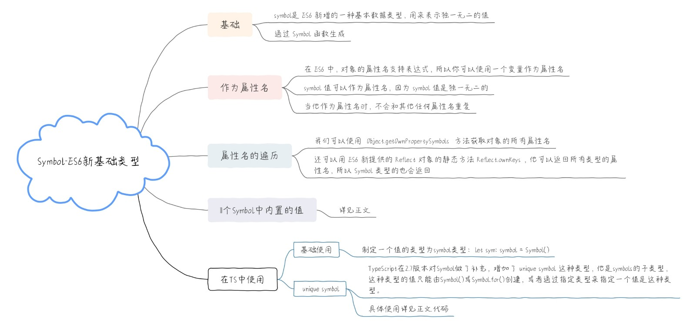

## typescript


#### ts中的基本类型和关键字

1. 字符串：string

2. 数值：number

3. 布尔值：boolean

4. 对象：object

5. undefined：undefined

6. null:null

7. 数组：type[]或Array[type]

8. Symbol:symbol   表示独一无二的值

   ```typescript
   //tips：
   let str:'miniYellow'  //此时给str赋值别的字符串报错  eg. str='111
   ```

      

   ##### symbol的使用

   1. 生成 

      ```javascript
      let  s = Symbol() 
      let  s1 = Symbol()  
      let  s2 = Symbol()  
      s1===s2  //false
      typeof  s  //'symbol'
      ```
   
      
   
   2. 可以传入字符串进行标识  
   
      ```javascript
      let s1 = Symbol('mini')  let s2 = Symbol('yellow')
      ```
   
   3. 可以转换为布尔值  true
   
      ```javascript
      let s = Symbol()
      console.log(Boolean(s))  //true
      ```
   
   4. 将symbol类型当做对象独一无二的属性名且引用时要用unique symbol类型且要用const声明，普通方式无法获取对象symbol属性名
   
   ```javascript
   let s = Symbol('miniYellow')
   const sym:unique Symbol('xx')
   let obj = {
       age:10,
       [s]:'soso',
       [sym]:"xixi"
   }
   console.log(obj[sym]) //xixi
   //这样使用forin或其他常见方法只能拿到age这个键
   //只拿到symbol类型键
   let ss = Object.getOwnPropertySymbols(obj)
   console.log(ss) //[Symbol(miniYellow)]
   //拿到所有键
   let ssr = Reflect.ownKeys(obj)
   console.log(ssr)  //["age",Symbol(miniYellow)]
   ```
   
   
   
   

#### ts中的补充类型

1. 元组      就是具有固定长度和准确的数组元素类型的数组
2. 枚举    给一组数字赋予名字，eg.做角色权限设置时，可以给角色id命名
3. any     任何类型 和未约束类型一样
4. void    表示没有任意类型，在函数没有返回值时可以赋给函数，可以赋值未undefined
5. never  表示永不存在的值得类型，eg.总会抛出异常或根本不会有返回值的函数表达式的返回值类型
6. unknown  未知类型
7. 联合类型
8. 交叉类型


#### 类型断言

有多种数据类型时，想使用不是共同拥有的方法时可使用**类型断言**来使用单个类型所独有的方法。


####  接口

使用const来定义常量，之后无法修改，但是如果const定义的是对象的话是可以修改对象里属性的值的，因此想要定义一个只读的对象属性要用**readonly**，定义一个只读变量用**const**  

